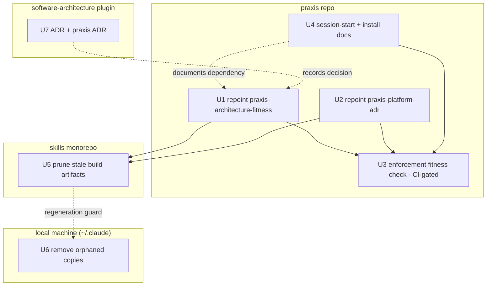

# refactor: Single-source the architecture method and repoint praxis to it

## Summary

Make the `software-architecture` plugin the sole home of the generic architecture method, repoint the two praxis skills to it as pointer-plus-delta, wire praxis's session-start to load the plugin skill alongside, and finish decommissioning the `engineering-*` layer — which research shows is now down to stale build artifacts and orphaned local copies.

This plan spans four locations. Each implementation unit names its **Repo**; paths are relative to that repo's root.

- `software-architecture-claude-plugin` (this repo) — the ADR record
- `praxis` (`Integral-Productivity/praxis`) — skill repoint, session-start wiring, enforcement check
- `skills` (`Integral-Productivity/skills` monorepo) — build-artifact cleanup
- local machine (`~/.claude/skills/`) — orphaned copy removal (not version-controlled)

---

## Problem Frame

The generic architecture method forked across three copies (the plugin, the deprecated `engineering-*` skills, and prose embedded in the praxis skills). Praxis declares itself a specialization of the deprecated names — `praxis-architecture-fitness` of `engineering-architecture-fitness`, `praxis-platform-adr` of `engineering-adr` / `engineering:architecture` / `engineering:system-design` — so it references the exact layer the plugin extraction was meant to retire. The brainstorm (see origin) chose to converge on the plugin as the single source of truth, repoint praxis directly, and decommission `engineering-*`.

Planning research then narrowed the decommission sharply: the `engineering-*` source dirs are already removed from the monorepo, `REGISTRY.md` already carries the redirect with the rename map, and the policy ADR (`skills` ADR-0004) already exists. What remains is mechanical cleanup plus the consumer-side repoint that the original extraction (ADR-0002) never anticipated praxis needing.

---

## Requirements

**Source of truth**

R1. The `software-architecture` plugin is the single canonical home for the generic architecture method; no other location maintains a parallel copy. *(origin R1)*

**Repoint (praxis consumes the plugin)**

R2. `praxis-architecture-fitness` references `software-architecture:architectural-fitness-functions` for the generic method and keeps only the praxis delta (spec+checks layout, `pnpm fitness`, HubSpot/Inngest/LangSmith/Supabase constants, encounter invariants, praxis check categories). *(origin R2)*

R3. `praxis-platform-adr` references the correct plugin successor for each old pointer it carries (see KTD6) and keeps only the praxis-platform constraints. *(origin R3)*

R4. No praxis skill — in body **or** `description:` frontmatter — references any `engineering-*`, `engineering:architecture`, or `engineering:system-design` name after the change. *(origin R4)*

**Session-start wiring**

R5. The `software-architecture` plugin is documented as a praxis dev-session dependency, installed from `integral-productivity-internal`. *(origin R5)*

R6. Praxis's session-start instruction loads both the referenced plugin method skill and `praxis-architecture-fitness`, so the method the pointer defers to is present when the framing fires. *(origin R6)*

**Decommission residual**

R7. The stale `engineering-*` build artifacts are removed from the `skills` monorepo, and the build/install path is confirmed not to regenerate them. *(origin R7, narrowed by research — sources, `REGISTRY.md` redirect, and policy ADR already shipped)*

R8. The orphaned `~/.claude/skills/engineering-*` local copies are removed. *(origin R8)*

**Hardening** *(resolves the brainstorm's deferred-to-planning open questions)*

R9. A praxis fitness check fails — as a blocking CI gate, not advisory — when any praxis skill or session-start prose references a decommissioned name, converting R4 from a one-time edit into an enforced invariant.

R10. The decision is recorded as an ADR in this plugin (extending the ADR-0002 migration note) plus a short praxis-side ADR for the new plugin dependency, including the version contract.

---

## Key Technical Decisions

**KTD1 — Praxis references the plugin directly, not a shared `engineering-*` parent.** The plugin is the single canonical method; praxis points at `software-architecture:*`. This accepts a cross-plugin install dependency in exchange for one source of truth. *(origin D1, D2)*

**KTD2 — Praxis skills are pointer-plus-delta, and the dependency is load-bearing.** Because `praxis-architecture-fitness` is invoked at every praxis session start to frame all work (`praxis/CLAUDE.md` Session Start), and it now defers all method to the plugin skill, the session-start instruction must load the plugin skill alongside it. A praxis session without the plugin installed gets a *thinner skill than today's self-contained one* exactly when it needs the framing — accepted as the cost of KTD1, mitigated by R5/R6 and the version contract in KTD7. *(origin D3)*

**KTD3 — Decommission is cleanup, not removal.** Research found the `engineering-*` sources gone, the `REGISTRY.md` redirect present, and the policy ADR (`skills` ADR-0004) written. The residual is pruning `build/engineering-*.{skill,hash}` and the orphaned local copies — do not re-delete or re-document what already shipped. U5 verifies the artifact list against live HEAD before acting.

**KTD4 — The enforcement check lives in praxis and gates CI.** Praxis is where a stale reference would regress. The check must run in the blocking CI fitness gate (the path guarded by the existing `ci-software-fitness-gate-wired.ts` check), not only in a session-start `pnpm fitness` invocation — a session-start skill instruction is LLM framing, not a merge gate, and R9 requires an *enforced* invariant. The monorepo runner's existing deprecation-lifecycle check is the conceptual precedent.

**KTD5 — The enforcement check scans the full decommissioned-name set across skills and session-start prose.** The check guards all five extracted names plus the two colon forms (`engineering:architecture`, `engineering:system-design`), scanning the entire `SKILL.md` (frontmatter included) and `praxis/CLAUDE.md`. Guarding the full set rather than only the two praxis references today is deliberate hardening; the spec constant names the source of each entry.

**KTD6 — Old pointers map by *kind*, not blanket to one successor.** `engineering-adr` is an ADR skill → `software-architecture:architecture-decision-records`. `engineering:architecture` and `engineering:system-design` were *generic architecture/design* pointers, not ADR pointers → map to `software-architecture:architectural-characteristics` and/or `software-architecture:architectural-trade-offs`, or remove the cross-reference where it no longer applies. Mapping the generic forms to `architecture-decision-records` would be a category error. The exact target per occurrence is a small implementer decision (see Open Questions).

**KTD7 — The cross-plugin reference needs a version contract.** The `integral-productivity-internal` marketplace lists `software-architecture` unpinned (resolves to the plugin repo's default-branch HEAD), while `praxis` is pinned to `ref: main`. Under the single-source model, praxis's deferred method floats on the plugin's HEAD, so a rename or section removal in the plugin silently degrades every praxis session — and the U3 check (old-name absence) cannot detect a *new* broken pointer. The ADR (U7) records the contract; pinning the marketplace entry to a tag/ref is the candidate mitigation (see Open Questions).

**KTD8 — The decision record extends ADR-0002.** ADR-0002 anticipated decommissioning `engineering-*` but not a second consumer (praxis) to repoint. A new ADR in this plugin records the cross-plugin-reference policy, the version contract, and that the decommission is complete; a short praxis-side ADR records the plugin dependency.

---

## High-Level Technical Design

Work crosses four locations. The repoint must land before the enforcement check can pass, and consumers should stop referencing the old names before the artifacts are pruned. The ADR records the decision and can land in parallel.

Directional guidance, not implementation specification.

---

## Implementation Units

### U1. Repoint `praxis-architecture-fitness` to the plugin

**Repo:** praxis
**Goal:** Strip the generic method from the skill, leaving a pointer to the plugin plus the praxis delta.
**Requirements:** R1, R2, R4
**Dependencies:** none
**Files:**
- `plugins/praxis/skills/praxis-architecture-fitness/SKILL.md`

**Approach:** Replace the opening blockquote reference to `engineering-architecture-fitness` (around line 22) with `software-architecture:architectural-fitness-functions`. Remove the re-stated generic method content (spec-first teaching that duplicates the plugin: discovery-question taxonomy, declared-gap theory, atomic/holistic explainer) and replace it with a one-line pointer to the plugin skill for the method. Keep all praxis-specific content: `src/fitness/` spec+checks layout, `pnpm fitness` toolchain, HubSpot/Inngest/LangSmith/Supabase constants, encounter invariants, and the praxis check categories (ubiquitous-language, lifecycle, CI). Preserve the praxis-specific *trigger content* of the `description:` frontmatter, but replace any decommissioned name that appears in it — "preserve" means keep the activation triggers, not keep the old names.

**Patterns to follow:** The pointer-plus-delta shape mirrors how `tdd-as-architectural-discipline` in this plugin points at `superpowers:test-driven-development` without duplicating it.

**Test scenarios:** `Test expectation: none — skill content; correctness is enforced by U3 (no stale references, frontmatter included) and verified by reading the skill for residual generic prose.` The session-start framing behavior is exercised by U4.

**Verification:** The skill contains no decommissioned name (body or frontmatter), no duplicated generic method prose, and the full praxis delta remains intact.

---

### U2. Repoint `praxis-platform-adr` to the plugin

**Repo:** praxis
**Goal:** Repoint each old pointer in the praxis ADR skill to its correct plugin successor, by kind.
**Requirements:** R3, R4
**Dependencies:** none
**Files:**
- `plugins/praxis/skills/praxis-platform-adr/SKILL.md`

**Approach:** This skill references the old layer in more places and more forms than U1. Before editing, audit the full `engineering-adr` / `engineering:` family in the file — do not trust a fixed line list. Known occurrences: `engineering-adr` (blockquote ~lines 17, 20); `engineering:architecture` (description frontmatter ~lines 10, 11; prose ~lines 40, 187); `engineering:system-design` (~line 193). Map by kind per KTD6:
- `engineering-adr` → `software-architecture:architecture-decision-records`.
- `engineering:architecture` / `engineering:system-design` (generic architecture/design pointers) → `software-architecture:architectural-characteristics` and/or `software-architecture:architectural-trade-offs`, or remove the cross-reference where it no longer applies (e.g., the "use the generic skill for non-praxis decisions" sentences).

Replace decommissioned names in the `description:` frontmatter too. Strip the generic ADR method down to a pointer; keep the praxis-platform constraints (dual audience, HubSpot abstraction, solo-operator velocity, Vercel+Supabase stack) and the praxis-specific "when to use" guidance.

**Patterns to follow:** Mirror U1's pointer-plus-delta structure so the two praxis skills read consistently.

**Test scenarios:** `Test expectation: none — skill content; correctness is enforced by U3 and verified by grepping the whole file (frontmatter included) for every old-name form.`

**Verification:** No occurrence of `engineering-adr`, `engineering:architecture`, or `engineering:system-design` remains anywhere in the file; each removed pointer is mapped to a kind-appropriate successor or intentionally dropped; the praxis-platform constraints are intact.

---

### U3. Add a praxis fitness check for stale decommissioned references

**Repo:** praxis
**Goal:** Fail `pnpm fitness` — and the CI fitness gate — when any praxis skill or session-start prose references a decommissioned name, so R4 stays true over time.
**Requirements:** R9 (enforces R4)
**Dependencies:** U1, U2, U4 (the check must pass once they land)
**Files:**
- `apps/platform/src/fitness/checks/static/` — new static check module
- `apps/platform/src/fitness/checks/index.ts` — register the new check in `STATIC_CHECKS`
- `apps/platform/src/fitness/spec/` — add the decommissioned-name list as a spec constant, each entry annotated with the origin requirement that retires it
- the CI fitness-gate wiring (the path the existing `ci-software-fitness-gate-wired.ts` check asserts) — confirm the new static check runs in the blocking gate, not only locally
- test file alongside the check, matching the repo's existing fitness-check test convention

**Approach:** A static check that scans the entire text (YAML frontmatter included) of `plugins/praxis/skills/**/SKILL.md` **and** `praxis/CLAUDE.md` for any decommissioned name in a declared list: `engineering-adr`, `engineering-architecture-fitness`, `engineering-tech-radar`, `engineering-bdd`, `event-driven-ddd-modeling`, and the colon forms `engineering:architecture` and `engineering:system-design`. Resolve the scan root from `process.cwd()` as repo root (matching the lifecycle-eval-gate precedent), not relative to `apps/platform`. Return a hard `fail` (blocking), not a soft difference report. Category `language` or `lifecycle`; `kind: static` (no credentials, CI-safe). Reuse the existing `pass`/`fail` helpers and ID conventions (`static.*`).

**Patterns to follow:** `apps/platform/src/fitness/checks/static/plugin-skill-lifecycle-eval-gate.ts` is the exact structural precedent — it already walks `plugins/praxis/skills/**/SKILL.md` from `process.cwd()`, reads each file, parses frontmatter, and returns `fail` with per-file messages. Use `ubiquitous-language.ts` only as a secondary reference for term-scanning regex shape (note: it scans `features/`, not skills, and reports soft non-blocking differences — do not copy its non-gating posture).

**Test scenarios:**
- Covers R4/R9. A skill body containing `engineering-adr` → `fail` naming the file and the offending term.
- A name in `description:` frontmatter (e.g., `engineering:architecture`) → `fail` (the scan covers frontmatter).
- `engineering:system-design` anywhere → `fail` (the list includes both colon forms).
- A decommissioned name in `praxis/CLAUDE.md` → `fail` (session-start prose is in scope).
- All scanned files clean (post-U1/U2/U4 state) → `pass`.
- A skill referencing the new `software-architecture:*` names → `pass` (no false positive on successor names).
- No skills directory present (defensive) → `pass` or `skip`, matching the runner's existing empty-state behavior.

**Verification:** With U1/U2/U4 landed, the new check runs in the CI fitness gate and passes; reintroducing any old name (in body, frontmatter, or `CLAUDE.md`) fails the gate with a clear message.

---

### U4. Wire praxis session-start and install docs for the plugin dependency

**Repo:** praxis
**Goal:** Ensure the plugin skill the pointers defer to is installed and loaded at session start.
**Requirements:** R5, R6
**Dependencies:** none (documents the dependency U1 creates; should land with or before U1)
**Files:**
- `praxis/CLAUDE.md` — Session Start section (around lines 3–7)

**Approach:** Extend the existing Session Start instruction. Today it invokes `praxis:praxis-architecture-fitness` and notes the `praxis@integral-productivity-internal` install. Add that the `software-architecture` plugin must also be installed from the same marketplace (`/plugin install software-architecture@integral-productivity-internal`), and that the session should load the referenced plugin method skill alongside `praxis-architecture-fitness` so the deferred method is present. The marketplace already lists `software-architecture`, so this is documentation/setup, not a publishing task. Use only `software-architecture:*` names here — this file is in U3's scan scope.

**Test scenarios:** `Test expectation: none — instruction/doc change. Verified by reading CLAUDE.md, confirming the install command resolves against the integral-productivity-internal marketplace manifest, and that U3's check passes on the edited file.`

**Verification:** `praxis/CLAUDE.md` names the plugin dependency and the dual-skill session-start load, carries no decommissioned name, and the install command matches an entry in the `integral-productivity-internal` marketplace.

---

### U5. Prune stale `engineering-*` build artifacts from the skills monorepo

**Repo:** skills (`Integral-Productivity/skills`)
**Goal:** Remove the leftover build outputs of the moved-out skills and confirm the build/install path does not regenerate them.
**Requirements:** R7
**Dependencies:** U1, U2 (no consumer references the old names before the artifacts are pruned)
**Files:**
- `build/engineering-adr.{skill,hash}`
- `build/engineering-architecture-fitness.{skill,hash}`
- `build/engineering-bdd.{skill,hash}`
- `build/engineering-tech-radar.{skill,hash}`
- `build/event-driven-ddd-modeling.{skill,hash}`
- `install.sh` and/or the build manifest — confirm the skill set derives from the `skills/` source tree, not a hardcoded list still naming the five

**Approach:** First verify against live HEAD — list the `build/engineering-*` and `build/event-driven-ddd-modeling` artifacts before deleting, reconcile against the list above, and note any additional stale artifacts. Then delete the confirmed-present artifacts. Confirm `install.sh` derives the installed set from the `skills/` source tree (already clean) rather than a hardcoded list; if it is in fact hardcoded, that is why the artifacts persisted and U5 grows to update the manifest. Do not touch `REGISTRY.md` (the redirect is already correct) or re-file the policy ADR (ADR-0004 exists). The similarly-stale `build/praxis-architecture-fitness.{skill,hash}` artifact is from the earlier praxis move; clean it alongside only if trivial, otherwise leave it to the follow-up issue (see Scope Boundaries).

**Test scenarios:** `Test expectation: none — build-artifact cleanup. Verified by a clean rebuild producing no engineering-* outputs and install.sh installing no engineering-* skill.`

**Verification:** `build/` contains no `engineering-*` outputs; a fresh `install.sh` run installs none; `REGISTRY.md` and ADR-0004 are unchanged.

---

### U6. Remove orphaned local `engineering-*` copies

**Repo:** local machine — `~/.claude/skills/` (not version-controlled)
**Goal:** Remove the stale draft copies that diverge from the plugin.
**Requirements:** R8
**Dependencies:** U5's regeneration guard confirmed (the `install.sh` derive-from-source check) — not the full U5 PR; the local copies are not the source-of-record, so removal only needs the guarantee they won't be regenerated
**Files:**
- `~/.claude/skills/engineering-adr/`
- `~/.claude/skills/engineering-architecture-fitness/`
- `~/.claude/skills/engineering-bdd/`
- `~/.claude/skills/engineering-tech-radar/`

**Approach:** Operator-local removal of the orphaned directories that exist locally (`status: draft`, not in any git repo). Research found four such directories — `event-driven-ddd-modeling` has no local copy, so the count here is four, not the five named in U5; verify with a directory listing before removing. Because the monorepo `install.sh` supersedes project-embedded copies, confirm a subsequent `install.sh` run does not re-create them (U5's manifest check covers the regeneration path).

**Execution note:** Operator-run local cleanup, not a committable change. Confirm the directories are the orphaned copies (not active symlinks into a plugin) before removing.

**Test scenarios:** `Test expectation: none — local filesystem cleanup. Verified by absence of the directories and a clean install.sh run that does not recreate them.`

**Verification:** The orphaned directories are gone and are not regenerated on the next install.

---

### U7. Record the decision (this-plugin ADR + praxis ADR)

**Repo:** software-architecture-claude-plugin (this repo) + praxis
**Goal:** Capture the single-source-of-truth + cross-plugin-reference decision, the version contract, and mark the decommission complete.
**Requirements:** R10
**Dependencies:** none (records decisions already made; can land in parallel)
**Files:**
- `docs/adr/0003-<slug>.md` (this repo) — new ADR
- `praxis/docs/adr/<NNN>-<slug>.md` (praxis) — short ADR recording the plugin dependency

**Approach:** Write a new ADR in this plugin extending ADR-0002's deferred migration note: the plugin is the canonical generic method; product plugins (starting with praxis) reference `software-architecture:*` directly rather than the retired `engineering-*` names; the cross-plugin reference is to a versioned plugin and the version contract is X (see KTD7 / Open Questions); the decommission is complete. Confirm the next ADR number against `docs/adr/` immediately before writing (per the IP numbering-reservation discipline — check the directory, this repo's memory, and in-flight PRs). On the praxis side, write a short ADR in `praxis/docs/adr/` (developer-facing, durable — not a note embedded in a skill body) recording the new dependency and pointing back to this plugin's ADR, so a future praxis contributor understands why the skills point at an external plugin.

**Patterns to follow:** This repo's existing ADRs (`docs/adr/0001`, `0002`) and the custom template if one exists under `docs/adr/`; praxis's existing `docs/adr/` numbering and template.

**Test scenarios:** `Test expectation: none — decision record. Verified by ADR presence, correct sequence numbers in both repos, and a back-reference from the praxis ADR.`

**Verification:** Both ADRs exist with unique sequence numbers; this plugin's ADR links to ADR-0002 and the origin brainstorm and states the version contract; the praxis ADR references it.

---

## Scope Boundaries

In scope: the praxis repoint (by-kind successor mapping, frontmatter included), session-start wiring, the CI-gated enforcement check, the build-artifact and local-copy cleanup, and the decision records.

### Deferred to Follow-Up Work

- **Stale `build/praxis-architecture-fitness.{skill,hash}` artifacts** in the skills monorepo — the same artifact-staleness class as U5 but from the earlier praxis move. File as a GitHub issue against `Integral-Productivity/skills` per the IP proposing-future-work convention; clean up in U5 only if trivial.
- **A monorepo-side enforcement check** mirroring U3 (fail the build if `engineering-*` reappears in `REGISTRY.md` or the build manifest) — U3 covers the praxis consumer, the higher-value surface; the monorepo check is a nice-to-have.

### Out of scope

- Rewriting or improving the generic method content — this effort relocates ownership, it does not change the method.
- The other praxis skills (`praxis-lineage-orchestrator`, `praxis-concept-audit`, etc.) and the plugin's internal skill structure.

---

## Risks & Dependencies

- **The cross-plugin pointer is inert without the plugin installed.** A praxis session that hasn't installed `software-architecture` gets a thinner skill than today's self-contained one at session start — precisely when `praxis-architecture-fitness` frames the work. U4 (install doc + dual-skill session-start load) is the mitigation; U3 catches stale *references* but not a *missing install*. Accept as the cost of KTD1's single-source-of-truth choice.
- **Version skew (distinct from missing install).** The marketplace lists `software-architecture` unpinned (HEAD); praxis is pinned to `ref: main`. A rename or section removal in the plugin silently degrades every praxis session's framing, and U3 (old-name absence) cannot detect a *new* broken pointer into the plugin. Mitigation: pin the marketplace entry to a tag/ref and/or record the rename-deprecation contract in U7's ADR (see Open Questions).
- **Multi-repo coordination.** The work lands as separate PRs in praxis, the skills monorepo, and this plugin, plus a local cleanup. Per IP multi-session discipline, a GitHub Project tracking the units-of-landing keeps them from crossing; the repoint (U1/U2/U4) should merge before the monorepo prune (U5) so no consumer references a removed artifact mid-flight.
- **`install.sh` derivation is assumed, not yet confirmed.** U5 treats the manifest as source-derived; if it is a hardcoded list (the plausible reason 10 artifacts persisted after sources were removed), U5 grows to update it and U6's regeneration guard depends on that fix.
- **Local copies are not version-controlled (U6).** They can silently return if an older `install.sh` re-copies them; U5's manifest check is the guard. Low stakes — machine-local only.

---

## Open Questions

**Resolve during implementation**

- **Successor target for the generic-architecture pointers.** `engineering:architecture` and `engineering:system-design` were generic architecture/design skills with no single 1:1 plugin successor. Default mapping: `architectural-characteristics` and/or `architectural-trade-offs` per context, or drop the cross-reference where it no longer applies. Confirm per occurrence during U2 (do not blanket-map to `architecture-decision-records`).
- **Pin the plugin version, or float HEAD?** Whether to pin the `software-architecture` marketplace entry to a tag/ref (matching praxis's `ref: main`) for a version contract, or accept floating HEAD and rely on the U7 ADR's documented rename-deprecation contract. Decided in U7; affects KTD7.

---

## Sources & Research

- Origin brainstorm: `docs/brainstorms/2026-06-12-architecture-fitness-skill-dedup-requirements.md`.
- Praxis edit sites (praxis repo): `plugins/praxis/skills/praxis-architecture-fitness/SKILL.md:22`; `plugins/praxis/skills/praxis-platform-adr/SKILL.md` — `engineering-adr` (lines 17, 20), `engineering:architecture` (frontmatter 10–11; prose 40, 187), `engineering:system-design` (193).
- Session-start framing: `praxis/CLAUDE.md` Session Start (lines 3–7) — invokes `praxis:praxis-architecture-fitness` at every session start.
- Enforcement precedent: `apps/platform/src/fitness/checks/static/plugin-skill-lifecycle-eval-gate.ts` (scans `plugins/praxis/skills/**/SKILL.md` from `process.cwd()`, parses frontmatter, hard `fail`) — the exact structural fit; `ubiquitous-language.ts` scans `features/` with a soft non-blocking report (secondary, regex-shape only). CI-gate wiring asserted by `ci-software-fitness-gate-wired.ts`.
- Decommission state (skills monorepo): `REGISTRY.md` already carries the five-skill "Moved out" redirect with the rename map and ADR-0004 link; source dirs already removed; `build/engineering-*.{skill,hash}` artifacts remain (10 files); `install.sh` derivation to be confirmed at U5.
- Decision lineage: this repo's `docs/adr/0002-establish-software-architecture-plugin-and-its-scope.md` (migration staged in two PRs; "old skill addresses won't work until users update"); `skills` ADR-0004 (practice-specific skills extract to dedicated plugins).
- Version contract: `marketplace-internal/.claude-plugin/marketplace.json` (manifest name `integral-productivity-internal`) lists both `praxis` (`ref: main`) and `software-architecture` (unpinned `github` source) — installable, but the unpinned entry is the version-skew exposure in KTD7.
